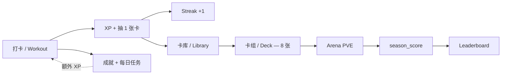
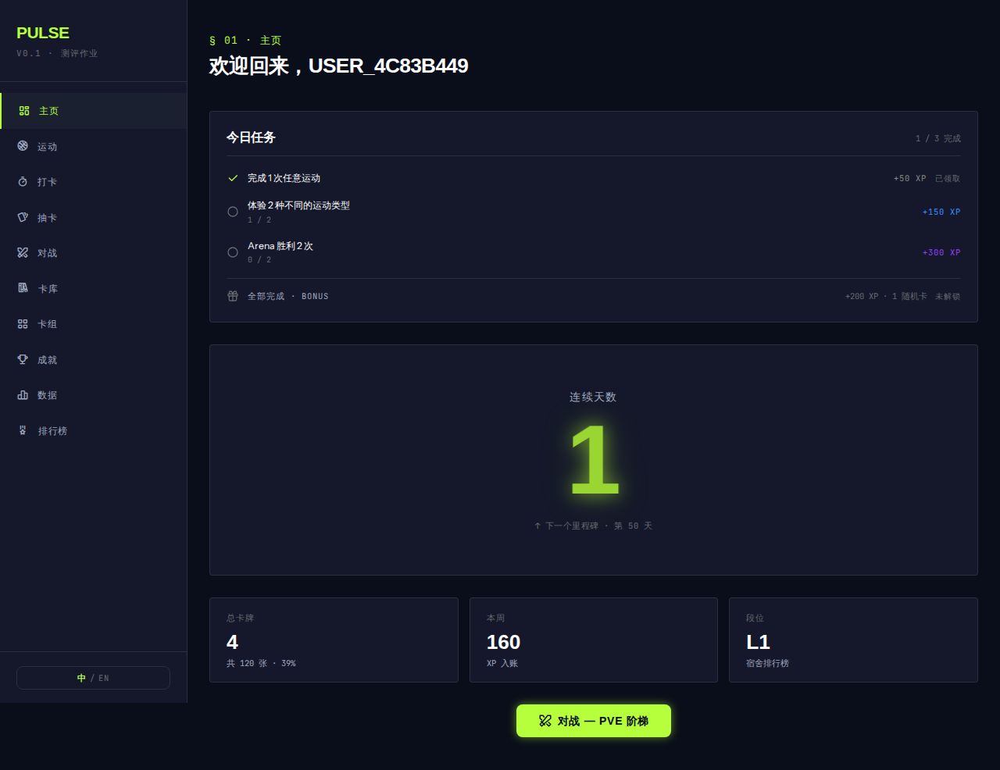
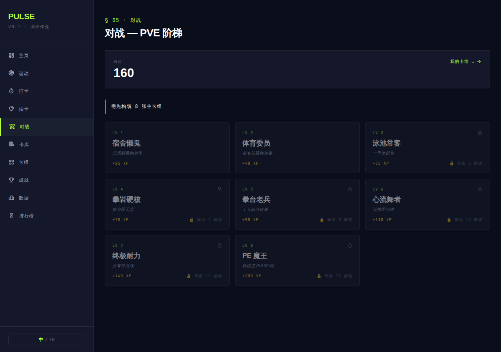
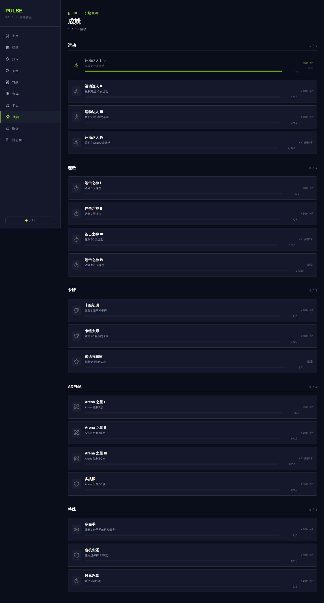
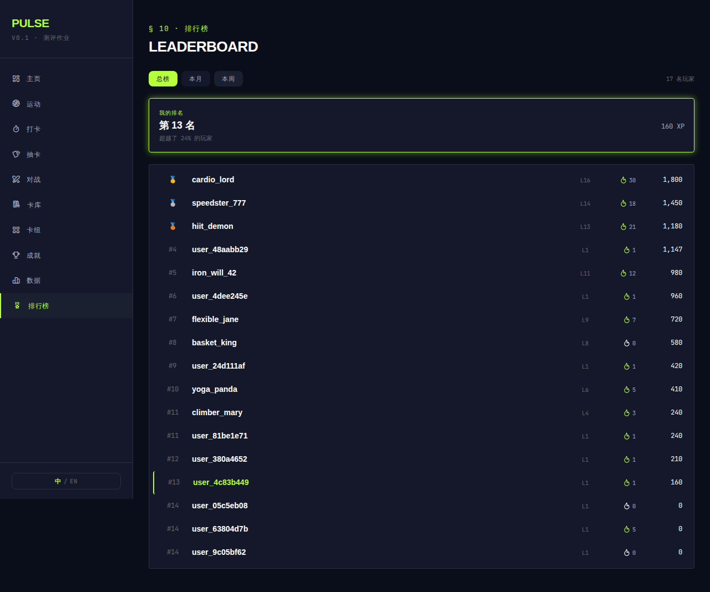
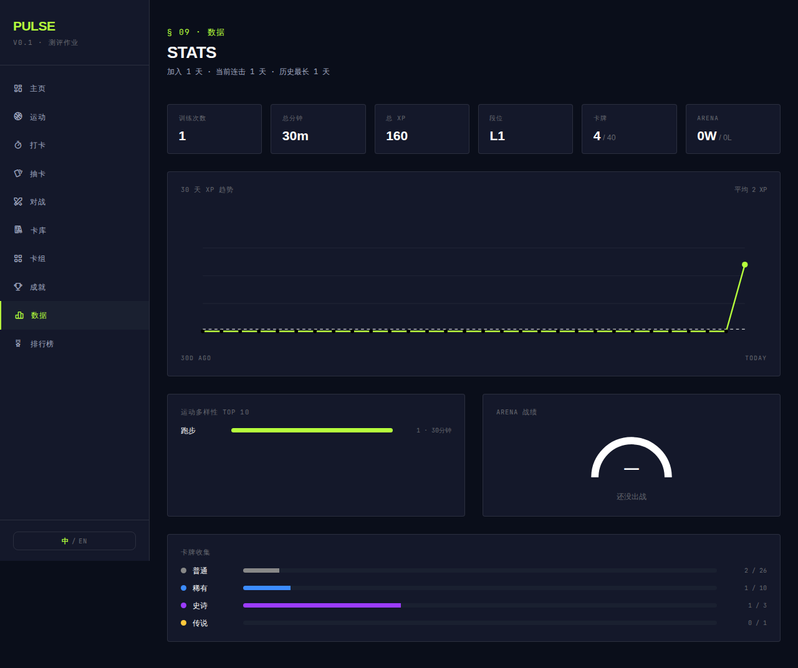

# PULSE — 美团编程游戏化运动激励工具

> 把"今天必须练"变成"今天能抽卡 + 上分"。一个把运动打卡转化为 RPG 进度感的 web 工具。

**测评作业 · v0.1 · 10 days build · 评判维度：产品思考完整度 + 评审在线亲自体验**

---

## 60 秒看懂



PULSE 把"今天必须练"重构成多层游戏化反馈：

- **基础回路：** 提交一次运动 → XP 入账 + 自动抽 1 张卡 + streak +1
- **卡牌回路：** 同卡叠加升星，攒 8 张组主卡组进 Arena 打 PVE
- **段位回路：** Arena 胜利拿 season_score，进 Leaderboard 跟 8 名 demo 用户对比
- **辅助回路：** 18 静态成就 + 每日 3 任务 + 每日 bonus 持续给小目标

---

## 主要页面

| Dashboard | Arena |
|:---:|:---:|
|  |  |

| Achievements | Leaderboard |
|:---:|:---:|
|  |  |

| Stats |
|:---:|
|  |

---

## 5 大机制

### 1. Streak（连续打卡）
- 每日打卡 +1，**断签不清零**
- 投入感正反馈：消耗 protect 卡续命，或 24h 内 `revive_streak` 一次
- 每 5 天解锁 1 张 protect 卡（最多 3 张库存）
- Onboarding 时赠 1 张 epic + 2 张随机

### 2. Loot（抽卡）
- 4 rarity：common / rare / epic / legendary
- 每次打卡保底掉 1 张
- 按运动类型有 buff（`exploration_buffs`）：练某类运动 → 下次抽对应类型的稀有度概率 +20-40%

### 3. Arena PVE
- 8 关阶梯，需先构筑 8 张主卡组
- 一回合制属性对撞：deck atk/def 总和 + 强度 / 时长加成
- 胜利拿 season_score，败北无惩罚

### 4. Achievements + Quests
- **18 静态成就** × 5 categories（workout / streak / cards / arena / special）
- **9 quest 模板** × 3 难度（easy / medium / hard），每日抽 3 个
- 完成 3/3 拿每日 bonus
- 全部走 `update_progress` hook，提交运动 / 打 PVE / 抽卡时自动累积

### 5. Leaderboard
- season_score 排序，`dense_rank()` 处理并列
- 3 种 period：Week (7d) / Month (30d) / All-time
- 高亮自己排名 + 击败百分比
- 8 名 demo 用户已 seed，开箱看到充实 board

---

## 设计决策亮点

1. **断签不清零** — 把"惩罚"重构成"投入感正反馈"。Streak 是用户最显性的沉没成本符号，归零会逼用户弃号；改成"消耗 protect 卡 / 24h 内 revive"等于多给一次机会，保留参与感。

2. **抽卡概率绑运动类型** — `exploration_buffs` 让"练得多 → 对应类别稀有度概率提升"，鼓励**多元化运动**而非只刷最易的运动。

3. **静态 + 每日双轨成就** — 18 静态成就是长期目标，每日 quest 是短期反馈，两者共享同一个 `update_progress` plpgsql hook，逻辑零重复。

4. **Schema-first + RPC-only** — 业务逻辑全写在 plpgsql RPC 里（用 `auth.uid()` 做内核），前端只 `useMutation/useQuery`。零业务校验在前端，RLS 默认 deny → multi-tenant 安全。

5. **Demo seed 走 trigger 友好** — 不直接 insert `public.users`，让 `handle_new_user` trigger 跑完再 UPDATE 列，避开 username UNIQUE collision。

6. **dev mode 第一公民** — `?dev=1` 激活的 dev drawer 有 7 个 action（set_streak / grant_legendary / break_streak / revive 等），评审 5 分钟内能看到所有边界状态而不需要真练 30 天。

---

## 数据
- 10 天累积式开发（小步可回退，全部 commit 在 main）
- 17 次 Supabase migration（schema + RPC + RLS + seed）
- 10 个 test 文件 / 57 unit test 全 green
- 12 个主 page / 10 个 nav item
- TypeScript strict / Tailwind v3 / 0 console error
- 移动端响应式（< 768px sidebar drawer）

---

## Stack
- **Frontend：** Vite 5 + React 18 + TypeScript (strict) + Tailwind v3
- **State：** Zustand + @tanstack/react-query
- **Routing：** react-router-dom v6
- **Backend：** Supabase Postgres + RLS + plpgsql RPC + 匿名 auth
- **Tests：** Vitest + @testing-library/react + jsdom
- **Package mgr：** Bun

---

## 本地运行

```bash
# 1. 装 deps
bun install

# 2. 配 Supabase
cp .env.example .env.local
# 编辑 .env.local 填 VITE_SUPABASE_URL + VITE_SUPABASE_ANON_KEY

# 3. push migrations（见 CLAUDE.md "Supabase migration push" 章节）

# 4. 启 dev server
bun run dev

# 5. 浏览器访问 localhost:5173
# 6. 评审快捷入口：localhost:5173?dev=1 → 开发者抽屉
```

---

## Dev 模式（评审用）

URL 加 `?dev=1` 激活（sessionStorage 持久化）。Sidebar 显示红色 DEV chip，点击或 `Cmd/Ctrl+Shift+D` 打开抽屉。

7 个调试 action：

| Action | 用途 |
|---|---|
| `set_streak` | 直接设 streak 长度（看高 streak 视觉） |
| `grant_legendary` | 立即拿 1 张 legendary |
| `level_up` | 跳 1 级 |
| `break_streak` | 制造断签场景测 revive |
| `grant_protect` | 加 1 张 protect 卡 |
| `reset_onboarding` | 清 onboarded_at 重看引导 |
| `reset_progress` | 清成就 / 任务进度（保留卡牌） |

---

## 仓库结构

```
src/
├── pages/        # 路由级 page（10 个主路由 + arena battle/result）
├── components/   # 复用组件 + Sidebar / DevDrawer / cards / onboarding / battle / deck / stats / leaderboard
├── api/          # Supabase RPC + React Query hook（每个 RPC 一个文件）
├── store/        # Zustand store（auth / dev / ui）
├── lib/          # 纯函数 + i18n + supabase client + streak / achievements / quests 助手
└── types/db.ts   # 数据库行类型

supabase/migrations/    # 17 个 cumulative migration
docs/superpowers/       # 每日 spec + plan（10 days）
docs/screenshots/       # README 用图
```

---

## 不做的事 / 后续 backlog

10 天 scope 内**未做**但已设计的：朋友 PVP（friends 系统 + battles vs_user）、Profile 页、推送提醒（service worker）、全 i18n EN 化、PWA。详见 `docs/superpowers/specs/` 各日设计的"不做的事"小节。
